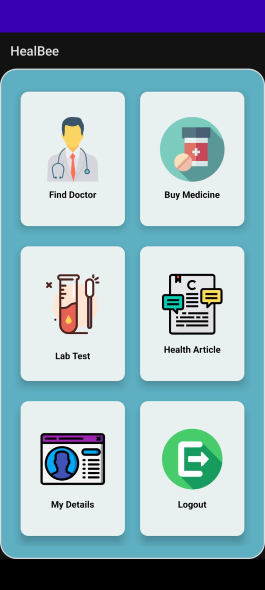
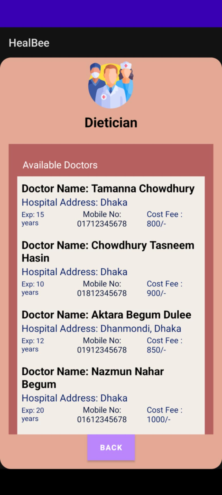
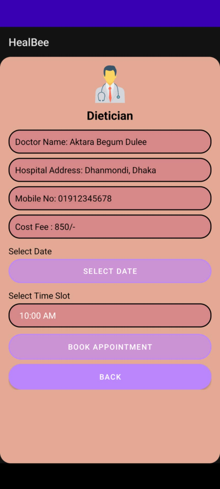
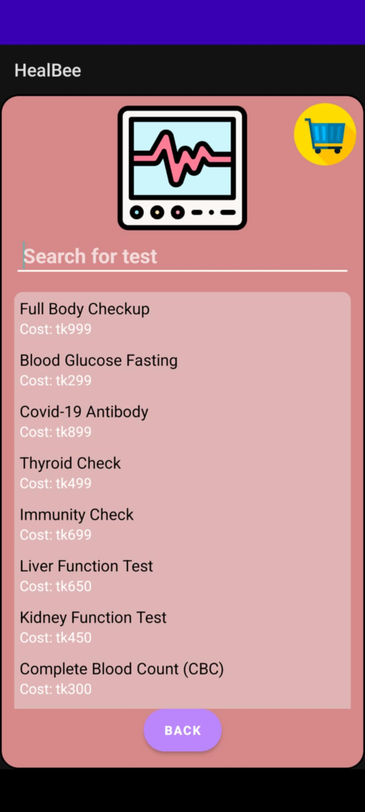
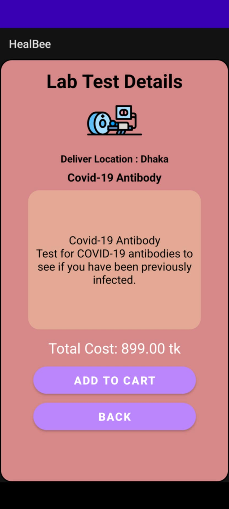
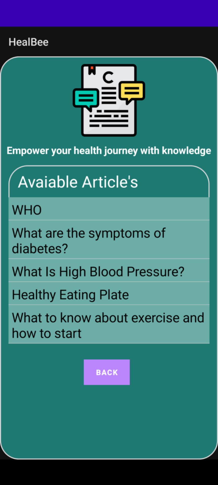

# HealbeeApp  
Comprehensive Healthcare Service Application

## ✅ Overview  
Healbee is an Android application designed to streamline healthcare services, offering users access to doctor search, appointment booking, lab test ordering, and medicine purchases in one integrated platform.

## 🛠️ Features  
- Search for medical specialists and book appointments.  
- Browse health-related articles.  
- View and purchase medicines.  
- Order lab test packages.  
- Track appointments and orders in user profile.

## 🧑‍💻 Technologies Used  
- Android Studio  
- Java & XML  
- Android SDK  
- UI layouts in XML  

## 📁 Project Structure  
- `/app` – Android app module  
- `/gradle`, `/gradlew` – Build system files  
- `.gitignore` – Excludes build artifacts  

## 📝 Installation & Setup  
1. Open Android Studio.  
2. File → Open → select `HealbeeApp` folder.  
3. Ensure SDK & build tools are installed.  
4. Run the app on emulator or device.

## 📄 Screenshots  

  
  
  

  
  
  

  
  
  

## 🎯 Goal & Impact  
- Improve accessibility and efficiency of healthcare services.  
- Provide a one-stop solution for doctor, lab, and medicine management.
